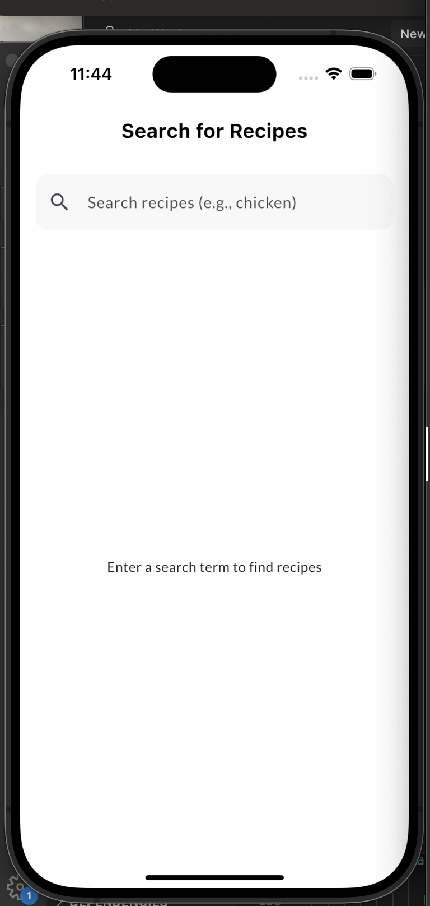
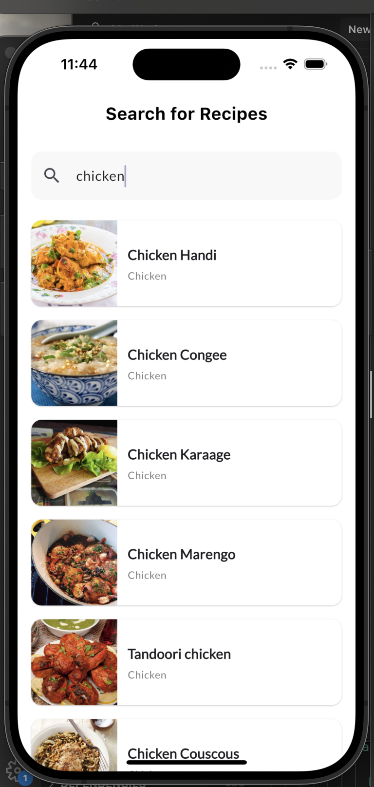
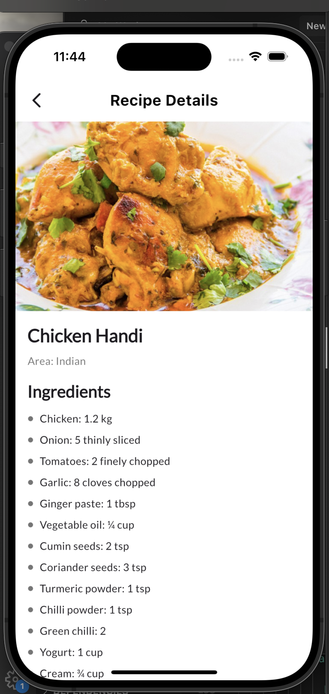
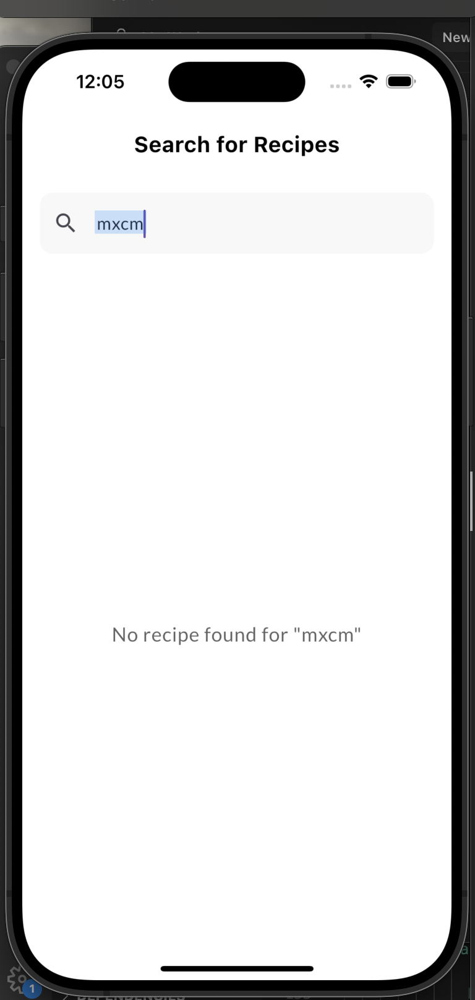

# recipe_finder

## Overview

Recipe Finder is a mobile application built with Flutter that allows users to search and explore a wide variety of recipes using the TheMealDB API. With a clean and intuitive interface, it provides detailed recipe information, including ingredients, instructions, and optional YouTube links. Leveraging Riverpod for state management and a clean architecture, this app offers a seamless experience for food enthusiasts and developers alike.

## Features

- **Recipe Search**: Search for recipes by name (e.g., "chicken", "pasta") with real-time results.
- **Detailed Views**: View recipe details, including ingredients, instructions, and thumbnails.
- **Error Handling**: User-friendly messages for no results (e.g., "No recipe found for {query}") or network issues with a retry option.
- **Responsive Design**: Optimized for both iOS and Android with a clean, modern UI.
- **API Integration**: Powered by TheMealDB API for a vast recipe database.

## Getting Started

### Project Structure
The project follows a clean architecture with the following structure:
- `lib/core/`: Contains core utilities (e.g., `network_client.dart` for API calls, `error/` for exceptions).
- `lib/features/recipes/`: holds the recipe feature, split into:
  - `data/`: Data sources (e.g., `recipe_remote_data_source.dart`) and repositories (e.g., `recipe_repository_impl.dart`).
  - `domain/`: Entities (e.g., `recipe.dart`) and use cases (e.g., `search_recipes.dart`).
  - `presentation/`: UI components (e.g., `recipe_search_page.dart`, `error_widget.dart`) and providers (e.g., `recipe_providers.dart`).
This separation ensures modularity and testability.

### State Management Logic
The app uses **Riverpod** for state management:
- `searchQueryProvider`: Manages the user's search input as a reactive state.
- `searchRecipesProvider` and `recipeDetailsProvider`: Async providers that fetch and cache recipe data or handle errors.
- Providers are defined in `recipe_providers.dart`, watching dependencies (e.g., `networkClientProvider`) and updating the UI via `ConsumerWidget`.
- Error states (e.g., `NoResultsFailure`, `NetworkFailure`) are handled with `CustomErrorWidget`, ensuring a smooth user experience.

### How to Run the App
1. **Clone the Repository**:
   git clone https://github.com/troykmf/recipe_finder.git
   cd recipe_finder

2. **Install dependencies**:
    flutter pub get

3. **Set Up App**:
    Ensure you have internet connection 

4. **Run the App**:
    flutter run

### Technologies used
 - Flutter 
 - Riverpod
 - TheMealDB Api
 - HTTP Package
 - Clean Architecture